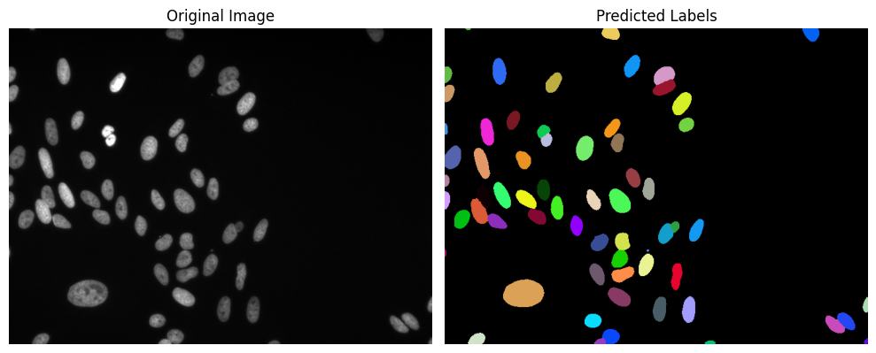
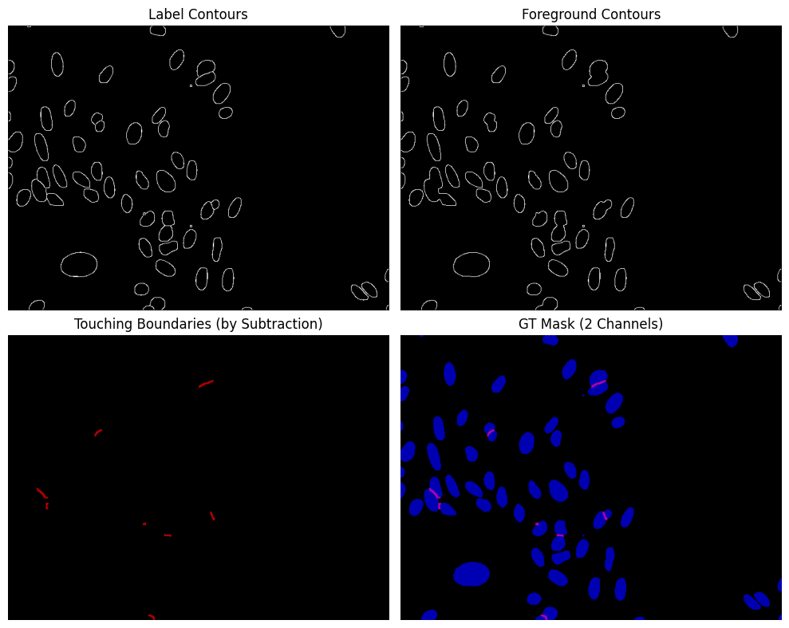
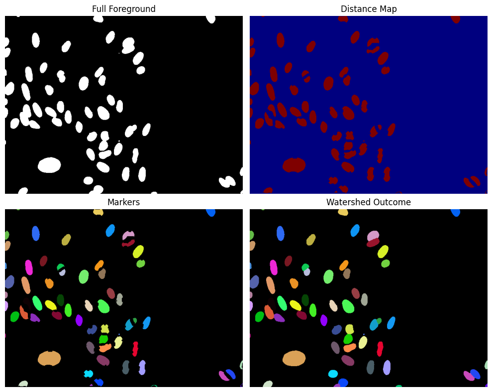
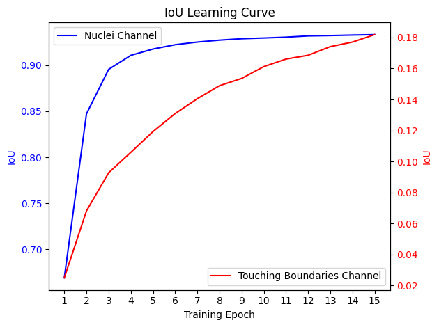
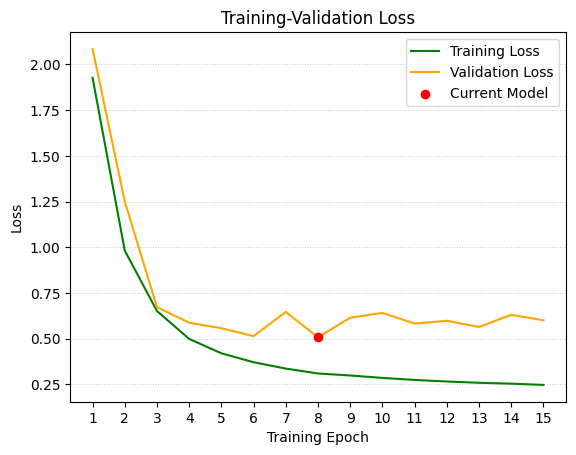

# Microscopy Image Segmentation with Machine Learning  
Work-in-progress project exploring state-of-the-art (SOTA) ML models for nuclei (cell body) segmentation in microscopy images.
<p align="center">

</p>


## Progress so far: Try for yourself!
### 🔬[Microscopy with ML](https://huggingface.co/spaces/asphodel-thuang/microscopy-with-ml)


## Status Summary

<h4>🟢 Highlights</h4>  

- Improved mask generation based on *watershed* method (Ref: [topcoders](https://www.kaggle.com/competitions/data-science-bowl-2018/discussion/54741))
<p align="center">

</p>

- Instance reconstruction using *watershed* method achieves 99% fidelity, and is not sensitive to the width of the *touching boundary*
<p align="center">

</p>


<h4>🟠 Challenge</h4>

- Class imbalance: Minor class (*touching boundary between nuclei*) is not learning effectively (under investigation)
<p align="center">

&nbsp;&nbsp;&nbsp;

</p>


<h4>🔵 Current Model Performance</h4>

- **0.78** Mean-average F1 score on a 50-image testset containing 5720 nuclei.
    - F1 score is calculated on nuclei instance basis
    - Average is across thresholds of nuclei instance IoU from 0.50 to 0.95 with a step size of 0.05
    - Dataset and score calculation is consistant with Ref: [Caicedo et al. 2018](https://onlinelibrary.wiley.com/doi/10.1002/cyto.a.23863)


Although the current results are still underperforming the above paper as a baseline, the goal of this project is to experiment better problem framing (mask design), and look to explore more SOTA model architectures on this Biomedical domain problem.

🏷️ Work in progress  
🏷️ Research-focused  
🏷️ Open to feedback and suggestions


## Learnings
- CNN models  
✅ Current best performing model is using **efficientnet_b3** backbone with a **Unet** architecture from [smp](https://smp.readthedocs.io/en/latest/models.html)

- Transformer-style models  
🔍 Transformer-style models performed poorly from my observation so far, mainly because of the early resolution reduction (1/4, 1/8,...) destroying local & fine feature like the *touching boundary between nuclei*.  
🧠 Worth explore transformer-style model as pre-classifier? To triage different imaging modalities to tailored segmentation model as oppose to heavy model ensambling like [topcoders](https://www.kaggle.com/competitions/data-science-bowl-2018/discussion/54741)


## More Details
See upcoming post


## How to Run

Prepare environment:
```bash
python3.11 -m venv venv
. venv/bin/activate
pip install -r requirements.txt
```

Download data:
```bash
python main.py
```

Run training:
```bash
python train.py
```
